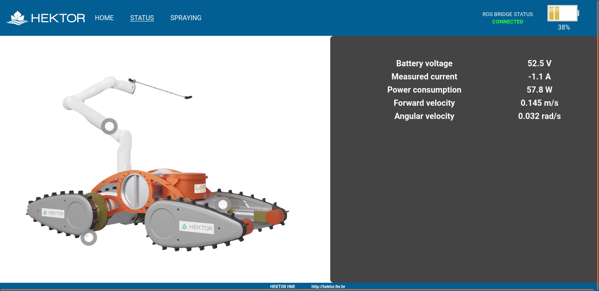

# HEKTOR HMI

Human Machine Interface developed for the heterogenous robotic system used in the [HEKTOR](https://hektor.fer.hr/) project using [rosbridge](https://github.com/RobotWebTools/rosbridge_suite).

## 🛠️ Usage

    roslaunch viv_hmi start_hmi.launch   

in viv_hmi/webpage

    python3 -m http.server 7000

goto:
 
    http://localhost:7000/index.html